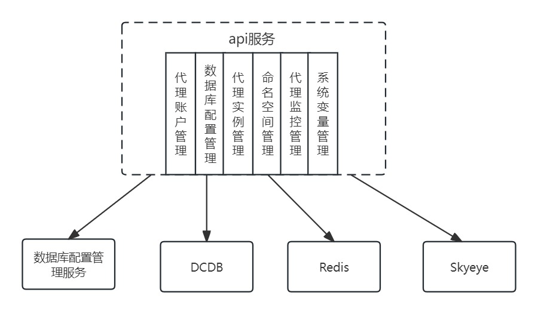
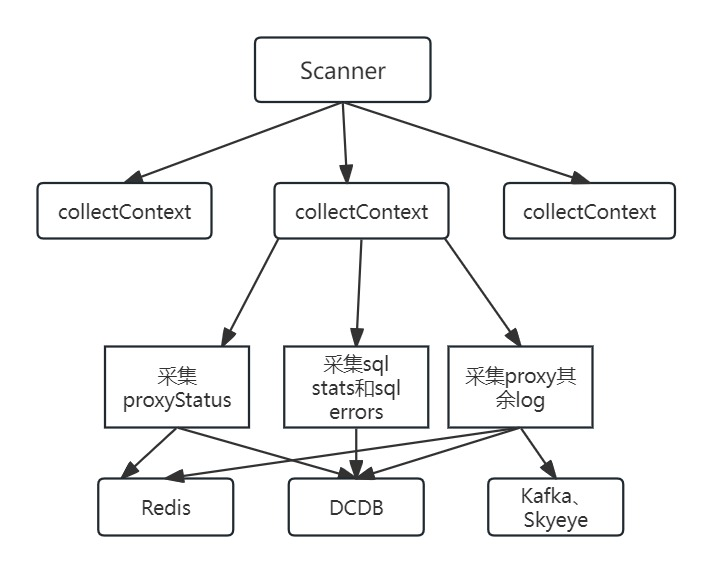
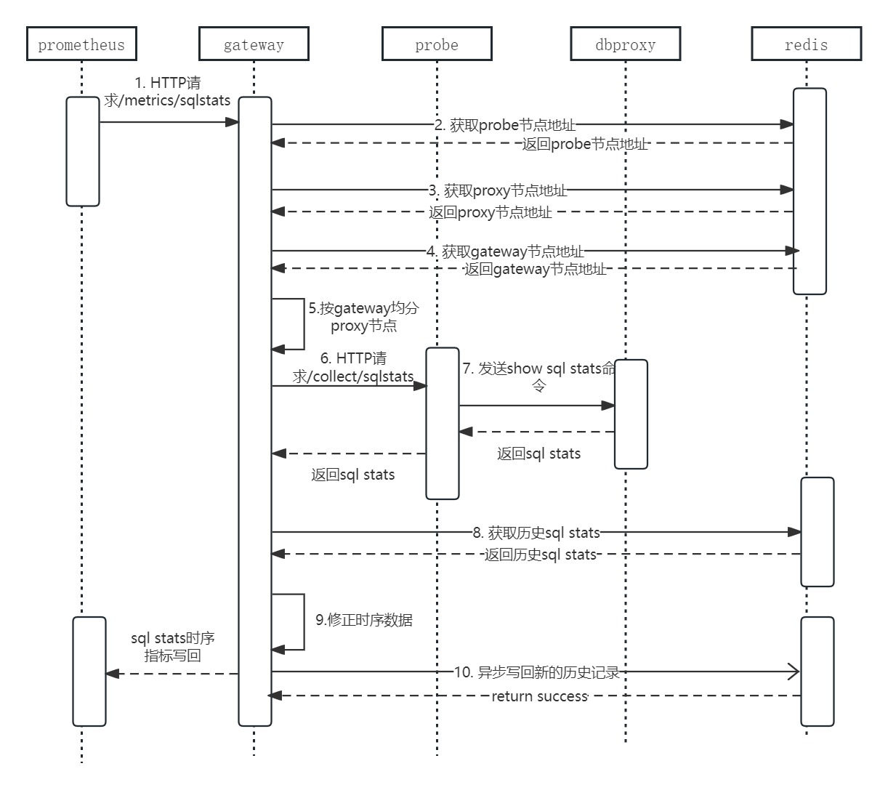
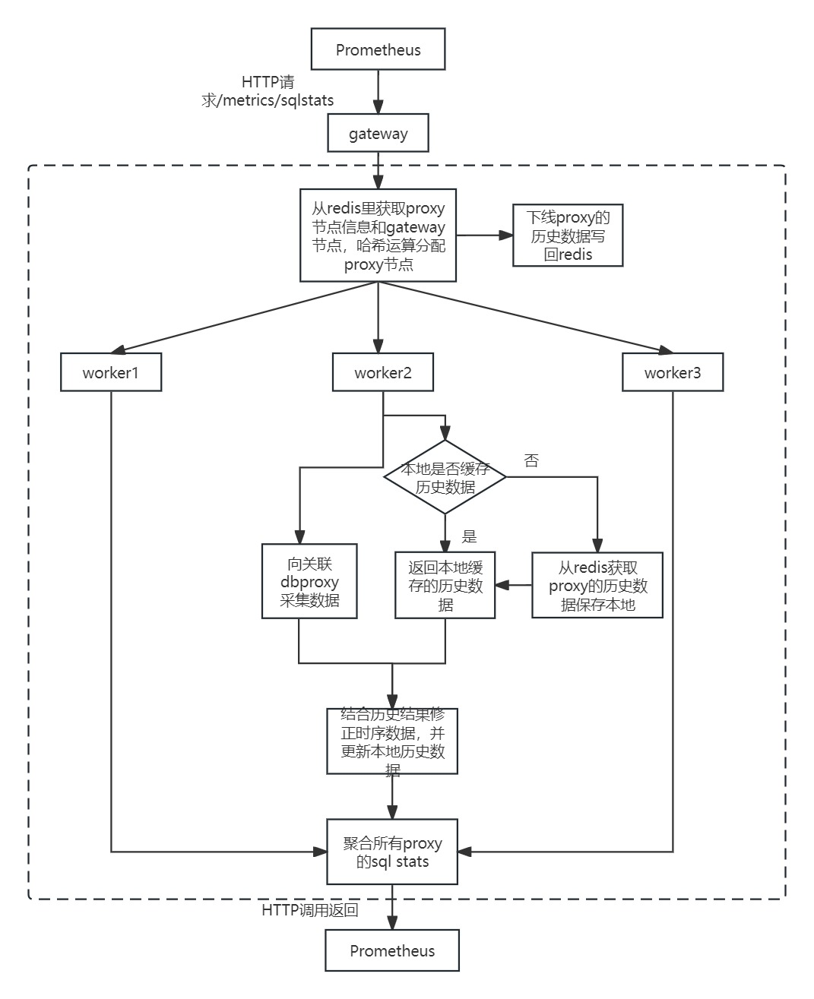
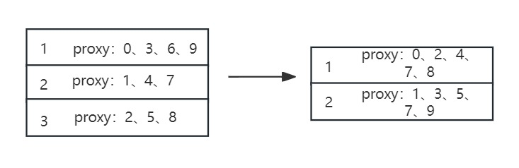
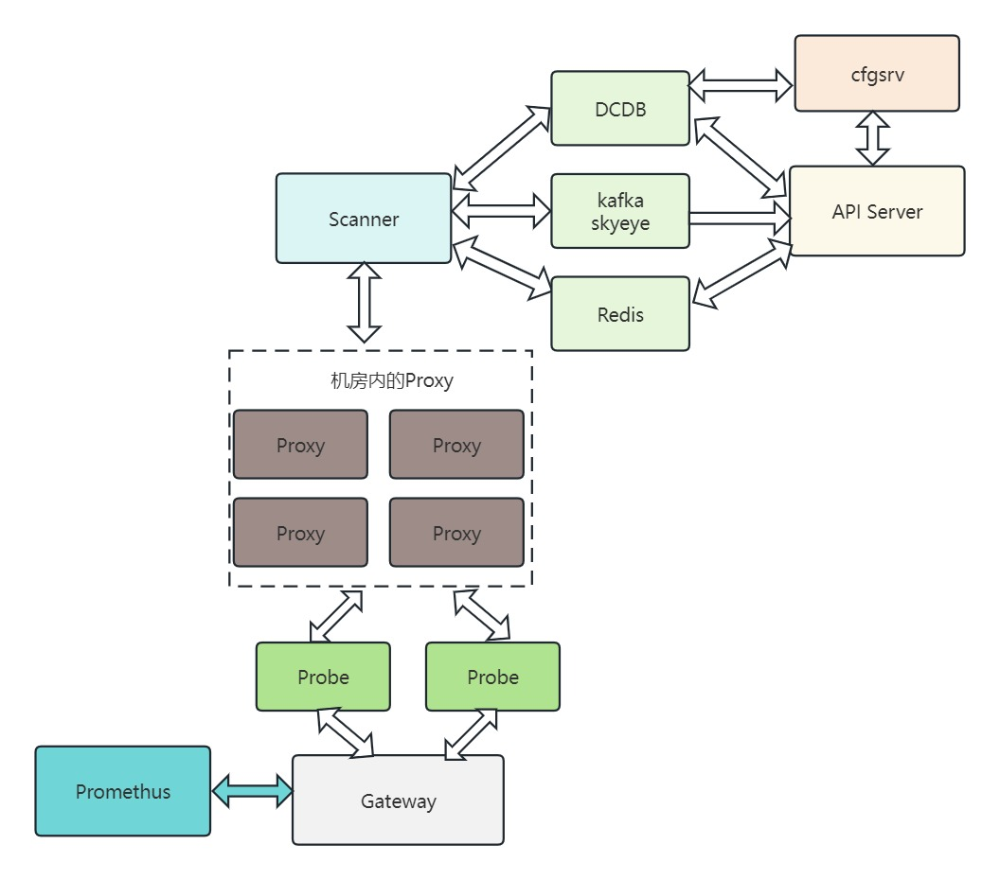

# 监控服务

## API Server

API server主要提供一些管理类的接口，这些接口可分为6个模块：代理账户管理、数据库配置管理、代理实例管理、命名空间管理、代理监控管理、系统变量管理。其中数据库配置管理相关接口需要请求数据库配置管理服务的接口获取数据，其余接口关联DCDB、Redis和Skyeye。

## Scanner

scanner主要负责数据的采集并写回，每个scanner内部包含多个collectContext，每个collectContext关联一个proxy实例，负责采集该proxy的所有信息包括状态信息、sql stats、sql errors、slowsql日志、慢事务日志、关键日志等，并写回到Redis、DCDB或kafka。

## Gateway

### 采集流程

### 主要开销

* 普罗米修斯服务器发起HTTP请求及时序指标结果返回
* redis获取probe、gateway、proxy节点地址
* HTTP调用probe接口并返回结果、probe发送命令给proxy获取数据
* 从redis里获取每个proxy的历史数据，并修正结果，将新的历史记录写回redis

### 优化点

当前采集流程逻辑上比较复杂，采集过程耗时时间较长，存在以下可以优化的点：

1. 去掉probe层，直接在gateway内实现对proxy的数据采集，可以减少一次HTTP调用与返回。
2. sql stats 历史数据与每个proxy相关联，将proxy与gateway服务建立绑定关系，就不需要每次都从redis里面去获取历史记录，并且修正完时序数据再重新写回redis，只需要在第一次绑定关系时需要去从redis里获取历史记录，此后将历史记录保留在内存中，直到proxy下线再将历史记录写回redis，可以避免每次采集大量的读写redis。
3. 现有的proxy分配策略，是根据redis里获取的proxy节点数量和gateway节点数量进行均分，如果要将proxy与gateway服务建立绑定关系，需要采用哈希运算分配proxy节点给gateway服务，这样可以避免单个proxy节点上线或下线引起其他proxy节点的重新分配，从而避免频繁读取和写回历史sql stats。
4. 随着proxy的运行时间增长，不同指纹的sql stats历史记录会一直增长，如果有一些指纹对应的sql很久未执行，该记录也会一直存在占用内存，因此sql history记录需要被淘汰。
5. sql stats历史记录与新的sql stats可以并行获取，只是在修正阶段需要同步。

### 改进后的采集流程

### 设计点

* 由每个worker对应一个proxy节点，负责proxy节点的时序数据的采集，对应优化点1、2
* 从redis里面获取gateway和proxy节点进行哈希运算分配proxy节点，对新分配的proxy节点创建一个worker负责采集，对下线的proxy将worker内的sql stats历史数据写回redis，对应优化点1、2、3
* 单个worker内部在接受任务时，并发的去采集数据和获取历史数据，然后修正时序数据并更新本地历史数据，对应优化点4、5

### 改进后的主要开销

* 普罗米修斯服务器发起HTTP请求及时序指标结果返回
* redis里获取gateway和proxy节点信息
* worker内发送命令给proxy采集数据，从redis里面获取历史sql stats(只有第一次采集需要)、历史sql stats写回redis(只有proxy绑定关系解除时需要)

### 可能存在的问题

1. 所有proxy的历史sql stats全部存在内存中会引起内存压力过大，可能需要写回一部分大节点的sql stats。
2. proxy节点分配的hash函数为`hash=proxy_id % gateway_size`，因此当gateway节点上线和下线会引起rehash，引起proxy节点重新分配，需要频繁的读写redis，所以在有gateway节点上下线时采集过程可能会变慢。例如10个proxy节点由3个gateway节点负责，当下线一个gateway节点时需要重新分配proxy节点。 

## 总结构图

