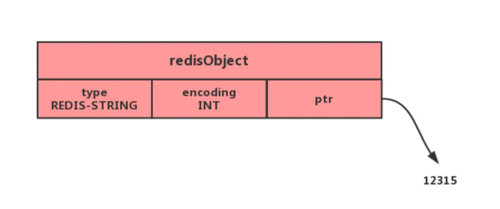

# redis

## 常见面试题

### Redis数据类型

* string类型的应用场景：缓存对象、常规计数、分布式锁、共享session信息
* list类型的应用场景：消息队列
* hash类型：缓存对象、购物车等
* set类型：聚合计算（并集、交集、差集），比如点赞、共同关注、抽奖活动
* zset类型：排序场景，比如排行榜、电话和姓名排序

1. string的内部实现：简单动态字符串(sds)。sds保存二进制数据，不以空字符判断字符串是否结束，而是使用len属性的值；sds获取字符串长度的时间复杂度为O(1)；sds是api安全的，拼接字符串不会导致缓冲区溢出。
2. list类型的内部实现：双向链表和压缩列表。元素个数小于512个，每个元素的值都小于64字节，采用压缩列表，否则采用双向链表。
3. hash的内部实现：元素个数小于512个，每个元素的值都小于64字节，采用压缩列表，否则采用哈希表。
4. set的内部实现：元素都是整数且元素个数小于 512采用整数集合实现，否则采用哈希表
5. zset的内部实现：元素个数小于128个，每个元素值小于64字节，采用压缩列表作为zset类型的底层数据结构，否则采用跳表实现

### Redis的线程模型

redis单线程：接收客户端请求->解析请求->进行数据读写操作->发送数据给客户端这个过程是由一个线程(主线程)来完成的。

redis2.0版本会启动两个后台线程，分别处理关闭文件、AOF刷盘这两个任务。redis4.0版本之后，新增了后台线程来异步释放redis内存，例如执行**unlink key/flushdb async/fllushall async**等命令，会将这些删除的操作交给后台线程来执行。**删除大key**的时候，不要用del命令删除，因为 del 是在主线程处理的，这样会导致 Redis 主线

程卡顿，应该使用 unlink 命令来异步删除大key。

初始化完成后，主线程进入事件循环函数:

1. 首先，先调用**处理发送队列函数**，看是发送队列里是否有任务，如果有发送任务，则通过 write 函数将客户端发送缓存区里的数据发送出去，如果这一轮数据没有发送完，就会注册写事件处理函数，等待 epoll_wait 发现可写后再处理 。
2. 调用 epoll_wait 函数等待事件的到来：
   * 如果是**连接事件**到来，则会调用**连接事件处理函数**，该函数会做这些事情：调用 accpet 获取已连接的 socket -> 调用 epoll_ctl 将已连接的 socket 加入到 epoll -> 注册「读事件」处理函数；
   * 如果是**读事件**到来，则会调用**读事件处理函数**，该函数会做这些事情：调用 read 获取客户端发送的数据 -> 解析命令 -> 处理命令 -> 将客户端对象添加到发送队列 -> 将执行结果写到发送缓存区等待发送；
   * 如果是**写事件**到来，则会调用**写事件处理函数**，该函数会做这些事情：通过 write 函数将客户端发送缓存区里的数据发送出去，如果这一轮数据没有发送完，就会继续注册写事件处理函数，等待 epoll_wait 发现可写后再处理 。

redis单线程为什么快：

1. 大部分操作都在内存当中，因此瓶颈可能是内存或网络带宽，而并非CPU
2. Redis 采用单线程模型可以**避免了多线程之间的竞争**，省去了多线程切换带来的时间和性能上的开销，而且也不会导致死锁问题

redis6.0之后引入了多线程：

在 Redis 6.0 版本之后，也采用了多个 I/O 线程来处理网络请求**，**这是因为随着网络硬件的性能提升，Redis 的性能瓶颈有时会出现在网络 I/O 的处理上。**但是对于命令的执行，Redis 仍然使用单线程来处理**。

因此， Redis 6.0 版本之后，Redis 在启动的时候，默认情况下会**额外创建 6 个线程**：

* Redis-server ： Redis的主线程，主要负责执行命令；
* bio_close_file、bio_aof_fsync、bio_lazy_free：三个后台线程，分别异步处理关闭文件任务、AOF刷盘任务、释放内存任务；
* io_thd_1、io_thd_2、io_thd_3：三个 I/O 线程

### Redis的持久化

Redis 共有三种数据持久化的方式：

- **AOF 日志**：每执行一条写操作命令，就把该命令以追加的方式写入到一个文件里；
- **RDB 快照**：将某一时刻的内存数据，以二进制的方式写入磁盘；
- **混合持久化方式**：Redis 4.0 新增的方式，集成了 AOF 和 RBD 的优点；

AOF日志：Redis 在执行完一条写操作命令后，就会**把该命令以追加的方式写入到一个文件**里，然后 Redis 重启时，会读取该文件记录的命令，然后逐一执行命令的方式来进行数据恢复。

## 数据类型篇

### String

#### 底层数据结构

int和sds简单动态字符串。相比于c字符串，sds的优势：

1. 保存文本数据还可以保存二进制数据。
2. sds获取字符串的时间复杂度是O(1)
3. redis的sds api是线程安全的，拼接字符串不会造成缓冲区溢出。

字符串对象的内部编码有3种：


1. 字符串对象保存的是整数值，并且这个整数值可以用long类型来表示，那么字符串对象会将整数数值保存在字符串对象结构的`ptr`属性里面(将void*转换成long)，并将字符串对象的编码设置为`int`

   

2. 保存的是字符串，且长度小于32字节，将使用sds保存字符串，并将编码设置为`embstr`

   

3. 字符串对象，并且长度大于32字节，将使用简单动态字符串来保存，并设置编码为`raw`

   

`embstr`编码的字符串分配连续的内存，只需要一次内存分配和释放，但是字符串的长度增加需要重新分配内存时，整个redisObject和sds都需要重新分配空间，所以**embstr编码的字符串对象实际上是只读的**。

#### 常用指令

```
SET name lin
GET name
EXISTS name
STRLEN name
DEL name
MSET key1 value1 key2 value2 
// 计数器（字符串的内容为整数的时候可以使用）
SET number 0
INCR number
INCRBY number 10
DECR number
SETNX key value // 不存在就插入
```

#### 应用场景

1. 缓存对象：直接缓存整个对象的 JSON，命令例子： `SET user:1 '{"name":"xiaolin", "age":18}'`。

2. 常规计数：因为 Redis 处理命令是单线程，所以执行命令的过程是原子的。因此 String 数据类型适合计数场景，比如计算访问次数、点赞、转发、库存数量等等。比如统计文章的阅读量：

   ```
   SET aritcle:readcount:1001 0
   INCR aritcle:readcount:1001
   GET aritcle:readcount:1001
   ```

3. 分布式锁：SET 命令有个 NX 参数可以实现「key不存在才插入」，可以用它来实现分布式锁：如果 key 不存在，则显示插入成功，可以用来表示加锁成功；如果 key 存在，则会显示插入失败，可以用来表示加锁失败。

   ```
   SET lock_key unique_value NX PX 10000
   // 设置分布式锁 PX为过期时间
   ```

   解锁过程就是将lock_key键删除，但是不能乱删，要保证执行操作的客户端是加锁的客户端。解锁有两个操作，所以需要lua脚本来保证解锁的原子性，因为redis在执行lua脚本时，可以以原子性的方式执行，保证了锁释放操作的原子性。

   ```
   // 释放锁时，先比较 unique_value 是否相等，避免锁的误释放
   if redis.call("get",KEYS[1]) == ARGV[1] then
       return redis.call("del",KEYS[1])
   else
       return 0
   end
   ```

4. 共享session信息：使用 Session 来保存用户的会话(登录)状态，这些 Session 信息会被保存在服务器端，但这只适用于单系统应用，如果是分布式系统此模式将不再适用。需要借助 Redis 对这些 Session 信息进行统一的存储和管理，这样无论请求发送到那台服务器，服务器都会去同一个 Redis 获取相关的 Session 信息，这样就解决了分布式系统下 Session 存储的问题。

   

### List

#### 底层实现

List的底层数据结构采用双向链表或压缩列表实现的

* 列表元素小于512个，列表每个元素的值都小于64字节，redis会采用压缩列表作为list类型的底层数据结构。
* 否则采用双向链表作为list的底层数据结构。

#### 常用命令

```
# 将一个或多个值value插入到key列表的表头(最左边)，最后的值在最前面
LPUSH key value [value ...] 
# 将一个或多个值value插入到key列表的表尾(最右边)
RPUSH key value [value ...]
# 移除并返回key列表的头元素
LPOP key     
# 移除并返回key列表的尾元素
RPOP key 

# 返回列表key中指定区间内的元素，区间以偏移量start和stop指定，从0开始
LRANGE key start stop

# 从key列表表头弹出一个元素，没有就阻塞timeout秒，如果timeout=0则一直阻塞
BLPOP key [key ...] timeout
# 从key列表表尾弹出一个元素，没有就阻塞timeout秒，如果timeout=0则一直阻塞
BRPOP key [key ...] timeout
```

#### 应用场景

消息队列

### Hash

#### 内部实现

采用压缩列表或哈希表实现

* 元素个数小于512个，所有值都小于64字节，采用压缩列表作为Hash的底层数据结构
* 哈希类型不满足条件：采用哈希表作为Hash的底层数据结构

#### 常用命令

```
# 存储一个哈希表key的键值
HSET key field value   
# 获取哈希表key对应的field键值
HGET key field

# 在一个哈希表key中存储多个键值对
HMSET key field value [field value...] 
# 批量获取哈希表key中多个field键值
HMGET key field [field ...]       
# 删除哈希表key中的field键值
HDEL key field [field ...]    

# 返回哈希表key中field的数量
HLEN key       
# 返回哈希表key中所有的键值
HGETALL key 

# 为哈希表key中field键的值加上增量n
HINCRBY key field n       
```

#### 应用场景

* 缓存对象：Hash类型的**（key，field，value）**的结构与对象的**(id, 属性，值)**的结构相类似，也可以用来存储对象。(类似key是一个数据库，field是不同的主键值，value为一行记录的对象的json值)。使用如下命令，将用户对象的信息存储到 Hash 类型：

  ```
  # 存储一个哈希表uid:1的键值
  > HMSET uid:1 name Tom age 15
  2
  # 存储一个哈希表uid:2的键值
  > HMSET uid:2 name Jerry age 13
  2
  # 获取哈希表用户id为1中所有的键值
  > HGETALL uid:1
  1) "name"
  2) "Tom"
  3) "age"
  4) "15"
  ```

  String + Json也是存储对象的一种方式，一般对象用 String + Json 存储，对象中某些频繁变化的属性可以考虑抽出来用 Hash 类型存储。

* 购物车：以用户 id 为 key，商品 id 为 field，商品数量为 value，恰好构成了购物车的3个要素。

### Set

Set 类型除了支持集合内的增删改查，同时还支持多个集合取交集、并集、差集。

#### 内部实现

* 如果集合中的元素都是整数且元素个数小于 `512`，采用整数集合实现
* 否则采用哈希表作为Set类型的底层数据结构

#### 常用命令

```
# 往集合key中存入元素，元素存在则忽略，若key不存在则新建
SADD key member [member ...]
# 从集合key中删除元素
SREM key member [member ...] 
# 获取集合key中所有元素
SMEMBERS key
# 获取集合key中的元素个数
SCARD key

# 判断member元素是否存在于集合key中
SISMEMBER key member

# 从集合key中随机选出count个元素，元素不从key中删除
SRANDMEMBER key [count]
# 从集合key中随机选出count个元素，元素从key中删除
SPOP key [count]
```

Set运算操作：

```
# 交集运算
SINTER key [key ...]
# 将交集结果存入新集合destination中
SINTERSTORE destination key [key ...]

# 并集运算
SUNION key [key ...]
# 将并集结果存入新集合destination中
SUNIONSTORE destination key [key ...]

# 差集运算
SDIFF key [key ...]
# 将差集结果存入新集合destination中
SDIFFSTORE destination key [key ...]
```

#### 应用场景

集合的主要几个特性，无序、不可重复、支持并交差等操作。

因此 Set 类型比较适合用来数据去重和保障数据的唯一性，还可以用来统计多个集合的交集、错集和并集等，当我们存储的数据是无序并且需要去重的情况下，比较适合使用集合类型进行存储。

* 点赞：Set 类型可以保证一个用户只能点一个赞，这里举例子一个场景，key 是文章id，value 是用户id。
* 共同关注：Set 类型支持交集运算，所以可以用来计算共同关注的好友、公众号等。
* 抽奖活动：存储某活动中中奖的用户名 ，Set 类型因为有去重功能，可以保证同一个用户不会中奖两次。

### Zset

Zset 类型（有序集合类型）相比于 Set 类型多了一个排序属性 score（分值），对于有序集合 ZSet 来说，每个存储元素相当于有两个值组成的，一个是有序集合的元素值，一个是排序值。

有序集合保留了集合不能有重复成员的特性（分值可以重复），但不同的是，有序集合中的元素可以排序。


#### 内部实现

Zset 类型的底层数据结构是由**压缩列表或跳表**实现的：

* 如果有序集合的元素个数小于 `128` 个，并且每个元素的值小于 `64` 字节时，Redis 会使用**压缩列表**作为 Zset 类型的底层数据结构；
* 否则采用跳表实现

#### 常用命令

#### 应用场景

Zset 类型（Sorted Set，有序集合） 可以根据元素的权重来排序，我们可以自己来决定每个元素的权重值。比如说，我们可以根据元素插入 Sorted Set 的时间确定权重值，先插入的元素权重小，后插入的元素权重大。

在面对需要展示最新列表、排行榜等场景时，如果数据更新频繁或者需要分页显示，可以优先考虑使用 Sorted Set。

* 排行榜：有序集合比较典型的使用场景就是排行榜。例如学生成绩的排名榜、游戏积分排行榜、视频播放排名、电商系统中商品的销量排名等。
* 电话、姓名排序：使用有序集合的 `ZRANGEBYLEX` 或 `ZREVRANGEBYLEX` 可以帮助我们实现电话号码或姓名的排序，我们以 `ZRANGEBYLEX` （返回指定成员区间内的成员，按 key 正序排列，分数必须相同）为例。

### BitMap

Bitmap，即位图，是一串连续的二进制数组（0和1），可以通过偏移量（offset）定位元素。BitMap通过最小的单位bit来进行`0|1`的设置，表示某个元素的值或者状态，时间复杂度为O(1)。

由于 bit 是计算机中最小的单位，使用它进行储存将非常节省空间，特别适合一些数据量大且使用**二值统计的场景**。

#### 内部实现

Bitmap 本身是用 String 类型作为底层数据结构实现的一种统计二值状态的数据类型。

String 类型是会保存为二进制的字节数组，所以，Redis 就把字节数组的每个 bit 位利用起来，用来表示一个元素的二值状态，你可以把 Bitmap 看作是一个 bit 数组。

#### 常用命令

#### 应用场景

Bitmap 类型非常适合二值状态统计的场景，这里的二值状态就是指集合元素的取值就只有 0 和 1 两种，在记录海量数据时，Bitmap 能够有效地节省内存空间。

* 签到统计
* 判断用户登录状态
* 连续签到的用户总数

